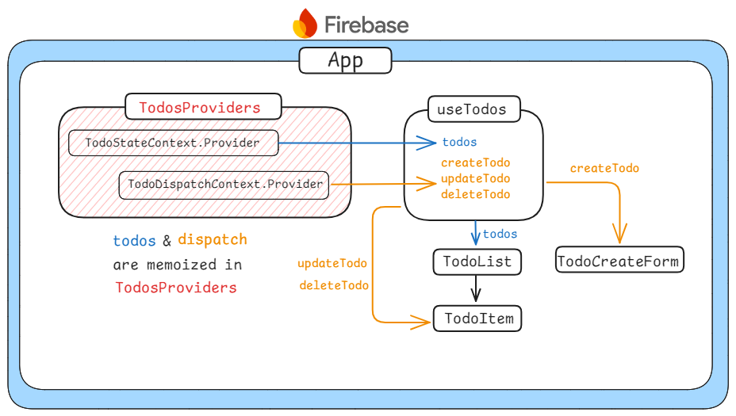

# Clush_Assignment_Project

## 프로젝트 소개 및 구현기능

본 프로젝트는 Clush 기업 과제 Todo 앱입니다. 사용자가 할 일을 생성, 표시, 수정, 삭제할 수 있는 기능을 제공하며, 효율적인 업무 관리를 돕는 것을 목표로 합니다.

### 주요 기능

- Todo 생성 및 표시: 사용자는 날짜를 지정해 새로운 할 일을 추가할 수 있으며, 기본값은 오늘 날짜로 설정됩니다. 추가된 할 일은 목록 형태로 표시됩니다.
- Todo 수정:
  - 완료 표시: 체크박스를 클릭하여 할 일 완료 여부를 표시합니다. 완료된 상태는 체크와 취소선으로 표현됩니다.
  - 내용 수정: 수정 버튼을 클릭하여 할 일의 내용을 변경할 수 있습니다.
- Todo 삭제: 더 이상 필요 없는 할 일을 목록에서 삭제합니다.

### 배포 링크

https://clush-45866.web.app/

## 기술스택

<p>


</p>

## 실행 방법

```sh
$ git clone https://github.com/theo-jin/clush_assignment_project.git
$ npm install
$ npm run build
$ npm run preview
```

## 주력으로 사용한 컴포넌트



### ContextAPI와 useReducer를 활용한 전역상태 관리 및 최적화

본 과제에서 todos라는 전역 상태를 관리하기 위해 useReducer와 ContextAPI를 활용했습니다.

과제를 처음 시작할 때는 useState만으로 작업을 진행했으나, 상태를 컴포넌트 바깥에서 사용해야 하는 상황이 생기면서 문제가 발생했습니다. 또한, 리스트 컴포넌트를 만들면서 props drilling이 발생하는 것이 맞물려서 useState만으로 상태 로직을 관리하는 데 어려움이 있었습니다.

이 문제를 해결하기 위해 useReducer와 ContextAPI를 선택했습니다. useReducer를 사용하면 현재 상태와 액션을 인자로 받아 새로운 상태를 반환하여 상태 변화의 일관성을 보장합니다. 또한, 모든 상태 변화가 명시적인 액션을 통해 이루어져서 상태 변화의 의도를 명확히 표현할 수 있기에 복잡한 상태 로직을 관리하는 데 적합하다 판단했습니다.
ContextAPI는 useReducer 상태를 컴포넌트 트리 전체에 효율적으로 전달할 수 있게 해줍니다.ContextAPI를 사용함으로써, 중간 컴포넌트들을 거치지 않고도 필요한 컴포넌트에 직접 상태와 dispatch 함수를 전달할 수 있습니다. 그래서 Props Drilling 문제를 효과적으로 해결하며, 컴포넌트 구조를 더 유연하게 만들어줍니다.

useReducer와 ContextAPI를 사용하여 로직 문제와 props drilling을 해결했지만, Provider의 value가 변경될 때마다 리렌더링 되는 문제가 발생했습니다.
useReducer에서 반환된 todos 상태와 이를 조작하는 dispatch 함수를 하나의 Context.Provider의 value로 묶어 전달했습니다. 그러나 이 경우 불필요한 리렌더링이 발생했습니다. Context API는 Provider의 value가 변경될 때마다 해당 Context를 사용하는 모든 컴포넌트를 리렌더링하기 때문에, todos 상태가 변경될 때마다 dispatch 함수만 사용하는 컴포넌트들도 리렌더링되는 문제가 발생했습니다.

이를 해결하기 위해, TodosProvider를 변경되는 값인 todos는 TodoStateContext로, 변하지 않는 함수인 dispatch(createTodo, updateTodo, deleteTodo)는 TodoDispatchContext로 분리하여 관리했습니다. 이렇게 함으로써 todos 상태의 변경이 dispatch 함수만을 사용하는 컴포넌트의 리렌더링을 유발하지 않도록 했습니다. 또한, 각각의 Context에 대해 useMemo를 사용하여 메모이제이션을 적용함으로써 불필요한 재생성을 방지했습니다.
이를 통해 상태 변경의 불필요한 영향을 최소화하고, 컴포넌트의 리렌더링이 필요한 경우에만 발생하도록 제어할 수 있었습니다.
