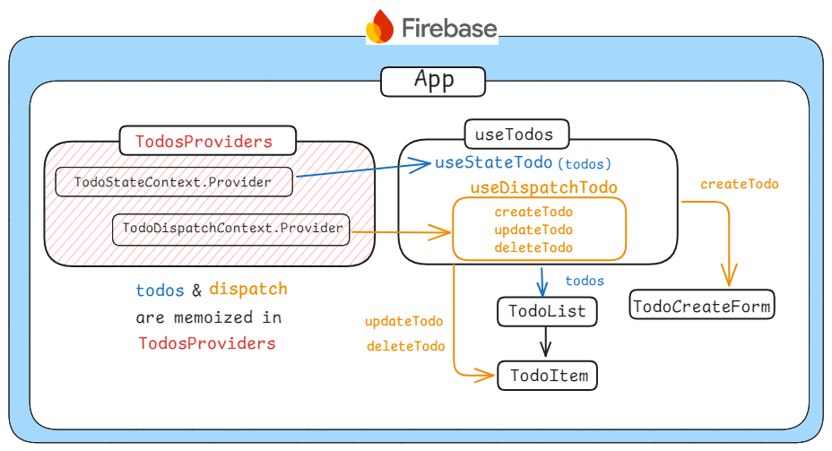

# Clush_Assignment_Project

## 프로젝트 소개 및 구현기능

본 프로젝트는 Clush 기업 과제 Todo 앱입니다. 사용자가 할 일을 생성, 표시, 수정, 삭제할 수 있는 기능을 제공하며, 효율적인 업무 관리를 돕는 것을 목표로 합니다.

### 주요 기능

- Todo 생성 및 표시: 사용자는 날짜를 지정해 새로운 할 일을 추가할 수 있으며, 기본값은 오늘 날짜로 설정됩니다. 추가된 할 일은 목록 형태로 표시됩니다.
- Todo 수정:
  - 완료 표시: 체크박스를 클릭하여 할 일 완료 여부를 표시합니다.
  - 내용 수정: 수정 버튼을 클릭하여 할 일의 내용을 변경할 수 있습니다.
- Todo 삭제: 더 이상 필요 없는 할 일을 목록에서 삭제합니다.

### 배포 링크

https://clush-45866.web.app/

## 기술스택


## 실행 방법

```sh
$ git clone https://github.com/theo-jin/clush_assignment_project.git
$ npm install
$ npm run build
$ npm run preview
```

## 주력으로 사용한 컴포넌트



TodoProviders에서 Context를 두 개로 분리하는 것에 가장 신경을 썼습니다. 과제를 진행하며 리스트 컴포넌트를 만들었을 때, de 2개뿐이었지만 props drilling이 발생했습니다. 이를 해결하기 위해 전역 상태로 상태 관리를 하려고 했습니다. 상태 관리가 복잡하지 않다고 판단했기 때문에, Zustand나 Redux Toolkit 같은 외부 라이브러리를 사용하지 않고 Context API로 전역 상태를 관리하기로 했습니다.

처음에는 TodosProvider라는 단일 Context로 todos, createTodo, updateTodo, deleteTodo 등을 관리했지만, 이전에 적용한 컴포넌트 최적화(memo 적용 등)가 제대로 작동하지 않는 문제가 발생했습니다. 이를 해결하기 위해, 변경 가능한 값인 todos는 TodoStateContext로, 변하지 않는 함수인 createTodo, updateTodo, deleteTodo는 TodoDispatchContext로 분리하여 Context를 관리했습니다.
